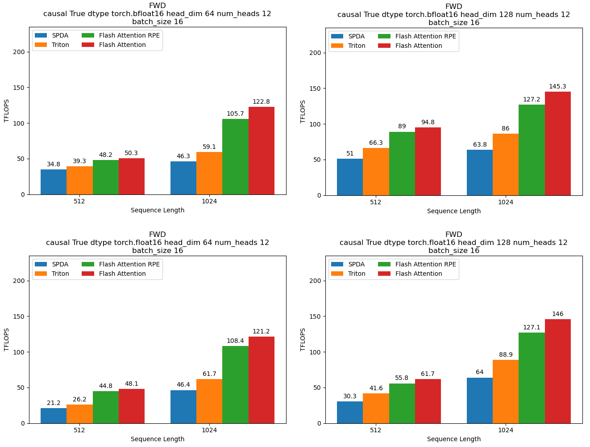
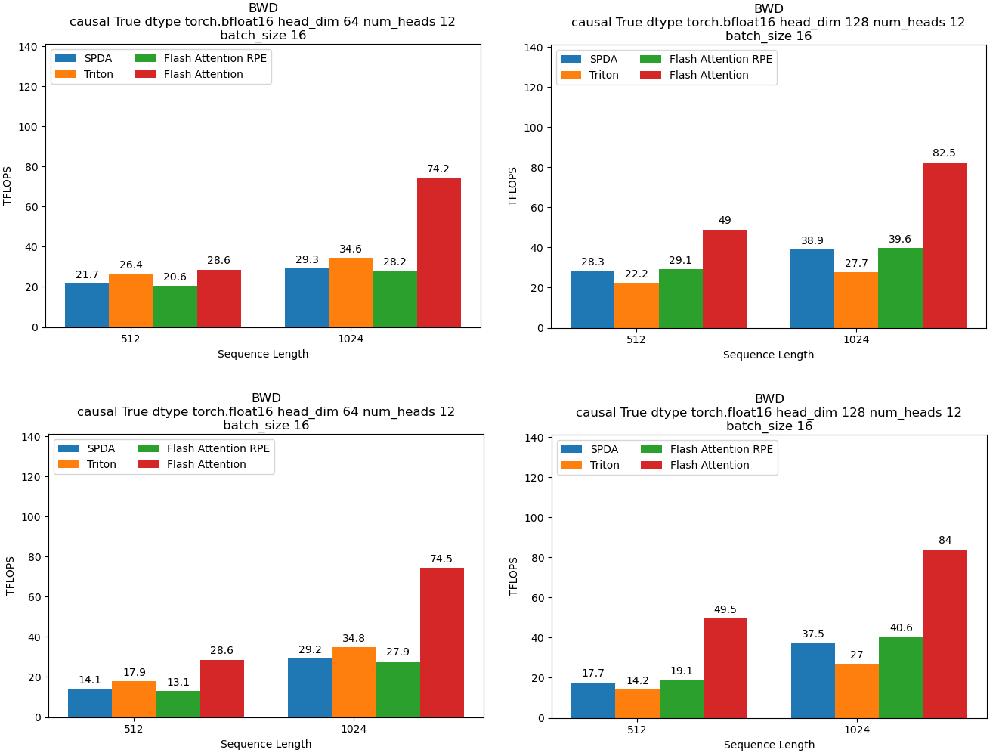
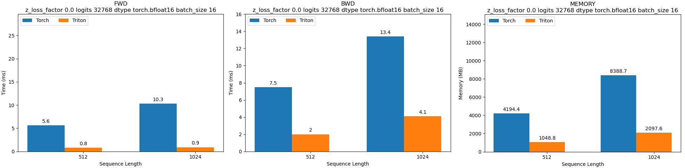
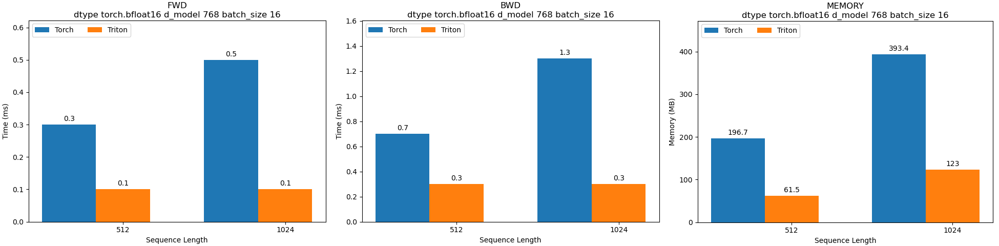

<div align="center">

# FAT5 - A fast implementation of T5/UL2 with Flash Attention

[](https://huggingface.co/collections/CATIE-AQ/catie-french-fat5-ul2-677697a35feea336389d6403)
[](https://opensource.org/licenses/Apache-2.0)
[](https://huggingface.co/spaces/CATIE-AQ/FAT5-report)
[](https://huggingface.co/spaces/CATIE-AQ/FAT5-rapport)
</div>

## News

- **January 2025 (precise date TBA)**: FAT5 "official release" with code, model weights and technical report (available in English and French).
  
- **3 October 2024**: Support [fa2-rpe patch](https://github.com/Dao-AILab/flash-attention/pull/956) for Flash Attention 2 : linear memory for T5-like relative position encoding.

- **23 September 2024**: Add a [tutorial](examples/minipile) to pretrain a small model on [minipile](https://huggingface.co/datasets/JeanKaddour/minipile).

- **20 September 2024**: Refactor optimizer supporting torch foreach operations and full bf16 training with Kahan summation (training do not converge using bf16 without it).

- **5 Feb 2024**: FAT5 initial release.

<br>

## Introduction

FAT5 (for **F**lash **A**ttention **T5**) is an implementation of T5 in PyTorch with an [UL2](https://arxiv.org/abs/2205.05131) objective optimized for GPGPU for both training and inference. 
It uses an experimental feature for using [Flash Attention](https://arxiv.org/abs/2307.08691) (v2) with relative position encoding biases that allow to train or finetune the model on longer sequence lengths than the original T5. It also has support for other positional embeddings such as [RoPE](https://arxiv.org/abs/2104.09864), [ALiBi](https://arxiv.org/abs/2108.12409) or [FIRE](https://arxiv.org/abs/2310.04418).  
This methodology enabled us to efficiently pretrain as a proof of concept a T5 with 147M parameters in French in a reasonable time (1,461H to see 419B tokens) and with limited resources (1 single A100; i.e. a computational budget of around €2,200). You can find the weights on [Hugging Face](https://huggingface.co/CATIE-AQ/FAT5-small).  
To achieve this, we designed CUDA/Triton kernels to make Flash Attention compatible with T5, and to provide linear inference, thus extending the context size that can be taken into account by the model.  
Other optimizations have also been implemented, as detailed in a subsequent [blog post](https://huggingface.co/spaces/CATIE-AQ/FAT5-report).

<br>

## Motivation

While a lot of effort has been focused on optimizing decoder-only models, in many practical applications older architectures remains useful.
We focus on [T5](http://jmlr.org/papers/v21/20-074.html), an encoder-decoder architecture exhibiting very decent performances for [instruction tuning](https://arxiv.org/pdf/2306.04757.pdf) or even sometimes outperforming much larger models when [finetuned](https://arxiv.org/pdf/2402.00841.pdf). Moreover it’s a natural architecture while considering [distillation](https://arxiv.org/abs/2305.02301) of much larger models.

A critical limitation of this architecture is the length of the sequence that these models can deal with due to the quadratic size in memory. While this quadratic term cannot be removed without considering other form of attention (like for [LongT5](https://arxiv.org/abs/2112.07916)), it can still be alleviated to accomodate longer sequence lengths.  
Another limitation is the pre-training time, since techniques such as Flash Attention are not available for this architecture. 

<br>

## Our work

We used the [nanoT5](https://github.com/PiotrNawrot/nanoT5?tab=readme-ov-file#cite) implementation as the base for our work.

We worked on optimizing the core component of the model, which is the attention part. We used the Flash Attention (v2) that optimize both the memory usage and the efficient use of Tensor Cores.

We support different implementation of attention biases:
- Full attention biases with Flash Attention 2 using this [PR](https://github.com/Dao-AILab/flash-attention/pull/617)
- T5-like relative position encoding biases with Flash Attention 2 using this [PR](https://github.com/Dao-AILab/flash-attention/pull/956)
- Full attention biases with a [triton implementation](src/model/ops/flash_attention_v2_bias.py) of Flash Attention 2

<div align="center">
<picture>
  <source media="(prefers-color-scheme: dark)" srcset="./assets/FAT5_dark.gif">
  
</picture>
</div>

Other parts of the architecture where optimized using [ad-hoc Triton kernels](src/model/ops/) for the cross-entropy (and z-loss) and layernorm.

For pretext tasks during pre-training, we use the [UL2](https://arxiv.org/abs/2205.05131v3) mixture of denoisers by Tay et Dehghani (2022) with the following 7 tasks:

  ```python
  denoiser_list=[
    {"mu": 3.0, "r": 0.15, "max_spans": max_token_length, "prefix": "[R]"},
    {"mu": 8.0, "r": 0.15, "max_spans": max_token_length, "prefix": "[R]"},
    {"mu": 4.0, "r": 0.0, "max_spans": 1, "prefix": "[S]"},
    {"mu": 3.0, "r": 0.5, "max_spans": max_token_length, "prefix": "[X]"},
    {"mu": 8.0, "r": 0.15, "max_spans": max_token_length, "prefix": "[X]"},
    {"mu": 64.0, "r": 0.15, "max_spans": max_token_length, "prefix": "[X]"},
    {"mu": 64.0, "r": 0.5, "max_spans": max_token_length, "prefix": "[X]"}]

  denoiser_proportions=[0.165, 0.165, 0.34, 0.0825, 0.0825, 0.0825, 0.0825]
  ```
  where `mu`: the span size, `r`: the % of masking in the span and `prefix`: the type of the pretext task (the meaning of the letters `[R]`, `[S]` and `[X]` is described [here](https://huggingface.co/google/ul2#mixture-of-denoisers)).

As there was no implementation available in PyTorch, we [added one](src/data/data_collator_ul2.py) and adapted a dynamic batching mechanism to reduce padding in the model.

<br>

## Benchmarks

<!--
The benchmarks were made on a A100 80G by comparing to the [original implementation of T5 v1.1](https://huggingface.co/docs/transformers/model_doc/t5v1.1) available on Hugging Face. The sequence length is the same for both the encoder and the decoder. Different sequence lengths for both parts are possible and even recommended depending on the application.

We see that below that for a sequence length below 256, `torch.compile` does a pretty good job in optimizing the model while the Flash Attention
start to pick up speed at 512 length and above. Note that the orignal model cannot accommodate larger than 512 sequence length despite using a 80G GPU!

<p float="left">
  
  
</p>

We can see a clear improvement in memory usage in our implementation for larger batch sizes (no value means OOM):

<p float="left">
  
  
</p>
-->

### TFLOPS

The number of TFLOPS (trillions of floating-point calculations a processor can perform in one second) is probably the most eloquent measure of the impact of the optimizations carried out.
We therefore compare four approaches:
- the SPDA (Scaled Dot Product Attention) implementation with full bias,
- the same implementation but in Triton,
- the Flash Attention RPE implementation (our kernel),
- the Flash Attention implementation, i.e. without bias. We've included it here for reference, as it's unusable in practice for a T5.

For the forward pass, we have:

<div align="center">
<picture>
  <source media="(prefers-color-scheme: dark)" srcset="./assets/benchmarks/FWD-causal-True_dark.png">
  
</picture>
</div>

<br>

For the forward pass, we can see that the Triton approach achieves 1.34 times more FLOPS than SPDA, and that the Flash Attention RPE approach achieves 1.99 times more FLOPS than SPDA.
We can also see that our bf16 implementation is equivalent to fp16 (doing even better at size 512).

For the backward pass, we have:

<div align="center">
<picture>
  <source media="(prefers-color-scheme: dark)" srcset="./assets/benchmarks/BWD-causal-True_dark.png">
  
</picture>
</div>

<br>

For the backward pass, the Triton implementation is less efficient than SPDA, with 0.71 times the FLOPS of SPDA. The Flash Attention RPE implementation is more or less equivalent to SPDA (1.018 times more FLOPS).
We can also observe that Triton in head_dim 64 is more efficient than Triton in head_dim 128.


### Torch vs Triton

<details>
We mentioned above that we had optimized parts of the architecture using ad hoc Triton kernels, namely the cross-entropy and RMSNorm layer. The following benchmarks should illustrate why.
For cross-entropy, we obtain a forward pass 7 to 11.4 times faster, a backward pass 3.26 to 3.75 times faster and a memory reduced by a factor of 4:

<div align="center">
<picture>
  <source media="(prefers-color-scheme: dark)" srcset="./assets/benchmarks/CE_dark.png">
  
</picture>
</div>

<br>

For the RMSNorm layer, we obtain a 3 to 5 times faster forward pass, a 2.33 to 4.33 times faster reverse pass and a memory reduced by a factor of 3.2:

<div align="center">
<picture>
  <source media="(prefers-color-scheme: dark)" srcset="./assets/benchmarks/LN_dark.png">
  
</picture>
</div>
</details>

Note that all benchmark graphs can be generated automatically using the following [code](https://github.com/catie-aq/flashT5/tree/main/benchmarks). 

<br>

## Applications

### To French
We've used the codes of this repository to pretrain a small (147M parameters) FAT5-UL2 in French.  
The weights will soon be released on our Hugging Face account [here](https://huggingface.co/CATIE-AQ/FAT5-small).  
The dataset we used is a mixture of [CulturaX](https://huggingface.co/datasets/uonlp/CulturaX), [Wikipedia](https://huggingface.co/datasets/wikimedia/wikipedia), [justice_fr](https://huggingface.co/datasets/eckendoerffer/justice_fr) and [The Stack](https://huggingface.co/datasets/bigcode/the-stack-dedup).
Our tokenizer of size 32,768 (8**5) is trained on CulturaX and The Stack.  
Our model is pre-trained on a sequence of 1,024 tokens on a single A100 for 1,461H (= 419.4B tokens seen) at an estimated cost of €2,200.

### To other language

Our contribution focuses on French, with the pre-training and finetuning of models for comparison against French benchmarks. For other languages, we can't afford to do the same kind of work.  

Nevertheless, to ensure that it can be used in other languages, we have developed a [code](https://github.com/catie-aq/flashT5/blob/main/convert_huggingface_t5.py) for adapting already pre-trained (m)T5/FLAN-T5 weights to our method. In this way, we hope users of a specific language will be able to efficiently continue pre-training one of these models to adapt it to more recent data, for example.  
Note, however, that this adaptation is limited, since the additional pre-training will have to be carried out within the precision of the original model. For example, if the model's weights are in FP32 (which is the case with the FLAN-T5), training will not be as fast as with the FAT5, which is in BF16.

For English speakers, we have already adapted the weights of the various versions of the [FLANT-T5](https://arxiv.org/abs/2210.11416) to our method. All weights can be found in this Hugging Face [collection](https://huggingface.co/collections/CATIE-AQ/catie-english-fat5-flan-662b679a8e855c7c0137d69e).  
To use one of the models, simply do the command:

```
from transformers import AutoModel, AutoTokenizer
model = AutoModel.from_pretrained("CATIE-AQ/FAT5-small-flan-en", trust_remote_code=True)
tokenizer = AutoTokenizer.from_pretrained("google/flan-t5-small")
```

<br>

## Pretraining

If you want to pre-train your own model (to be specialized in a specific domain for example, and thus benefit from a custom tokenizer), we included a [tutorial](examples/minipile) to pretrain a small model on [minipile](https://huggingface.co/datasets/JeanKaddour/minipile) to show how it should be done.  
You can find the documentation of the model configuration file [here](docs/configuration_file.md).  
Note that we tested and trained the model of the tutorial on A100. It may or may not work with other GPUs.  

<br>

## Finetuning

Once you've pre-trained your model, you'll want to finetune it. Because it's a custom model (hence the need for `trust_remote_code=True` to load it), it's currently causing some difficulties due to flaws in Hugging Face's Transformers library (during the `push_to_hub`, for example). This should be resolved in January 2025, as we're working on porting the FAT5 directly into Transformers with the help of their lovely team 🤗

<br>

## Roadmap
Here is several following up works that we would like to make:

- Experiment with finetuning or distillation with long sequences.

- Experiment with [SpacTor](https://arxiv.org/abs/2401.13160)

- We are also trying to revisit the encoder-decoder architecture using subquadratic operators to replace the attention. Stay tuned for more information about this.

<br>

## License
[Apache-2.0 license](https://github.com/catie-aq/flashT5/tree/main?tab=Apache-2.0-1-ov-file#readme)

<br>

## Ackowledgment

We use the following repos and thanks the authors for this:
- [nanoT5](https://github.com/PiotrNawrot/nanoT5) for the simple implementation and the optimizer.
- [Flash attention](https://github.com/Dao-AILab/flash-attention) for the groundbreaking algorithm for computing attention.
- [Hugging Face](https://github.com/huggingface/transformers) for their excellent library.
- [FlagAttention](https://github.com/FlagOpen/FlagAttention) for the implementation of FA2 in Triton.
- [Unsloth](https://github.com/unslothai/unsloth) for the simple Triton kernels of the cross-entropy and layernorm that we adapted to our usage.
- [TurboT5](https://github.com/Knowledgator/TurboT5) for the improvement of the February 2024 version of our work.

This work was support by the [Vaniila platform](http://vaniila.ai/).<br>
<div align="center">
  <a href="[https://example.com](http://vaniila.ai/)" target="_blank">
    
  </a>
</div>
