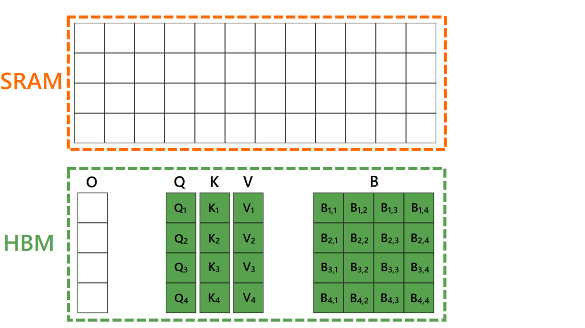
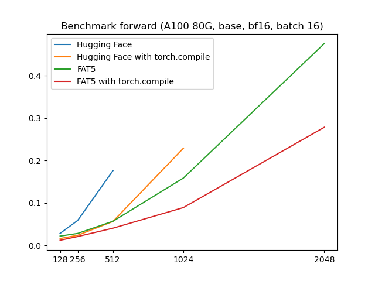
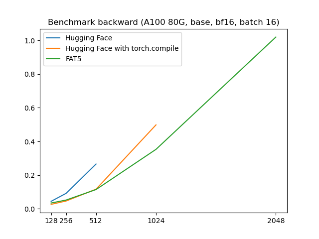
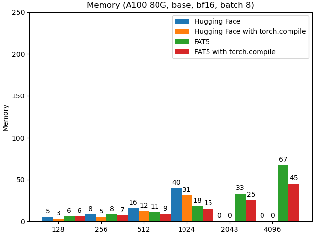
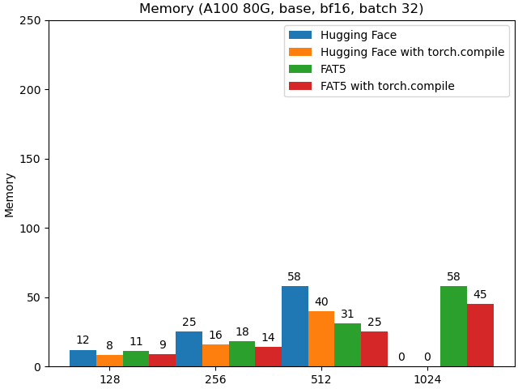

<div align="center">

# FAT5 - A fast implementation of T5/UL2 with Flash Attention

[](https://huggingface.co/collections/CATIE-AQ/catie-english-fat5-flan-662b679a8e855c7c0137d69e)
[](https://opensource.org/licenses/Apache-2.0)
</div>

## News

- **3 October 2024**: Support [fa2-rpe patch](https://github.com/Dao-AILab/flash-attention/pull/956) for Flash Attention 2 : linear memory for T5-like relative position encoding.

- **23 September 2024**: Add a [tutorial](examples/minipile) to pretrain a small model on [minipile](https://huggingface.co/datasets/JeanKaddour/minipile)

- **20 September 2024**: Refactor optimizer supporting torch foreach operations and full bf16 training with Kahan summation (training do not converge using bf16 without it)

- **5 Feb 2024**: FAT5 initial release.


## Introduction

FAT5 (for **F**lash **A**ttention **T5**) is an implementation of T5 in PyTorch with an UL2 objective optimized for GPGPU for both training and inference.
It uses an experimental feature for using [Flash Attention (v2)](https://arxiv.org/abs/2307.08691) with relative position encoding biases
that allow to train or finetune the model on longer sequence lengths than the original T5. It also has support for other positional embeddings such as RoPE, ALiBi or FIRE.

## Motivation

While a lot of effort has been focused on optimizing decoder-only models, in many practical applications older architectures remains useful.
We focus on [T5](http://jmlr.org/papers/v21/20-074.html) by Raffel et al. (2020), an encoder-decoder architecture exhibiting very decent performances for [instruction tuning](https://arxiv.org/pdf/2306.04757.pdf) or even sometimes outperforming much larger models when [finetuned](https://arxiv.org/pdf/2402.00841.pdf). Moreover it’s a natural architecture while considering [distillation](https://arxiv.org/abs/2305.02301) of much larger models.

A critical limitation of this architecture is the length of the sequence that these models can deal with due to the quadratic size in memory. While this quadratic term cannot be removed without considering other form of attention (like for [LongT5](https://arxiv.org/abs/2112.07916)), it can
still be alleviated to accomodate longer sequence lengths.

## Our work

We used the [nanoT5](https://github.com/PiotrNawrot/nanoT5?tab=readme-ov-file#cite) implementation (Nawrot, 2023) as the base for our work.

We worked on optimizing the core component of the model, which is the attention part. We used the [Flash Attention (v2)](https://arxiv.org/abs/2307.08691) by Dao (2023) that optimize both the memory usage and the efficient use of Tensor Cores.

We support different implementation of attention biases:
- Full attention biases with Flash Attention 2 using this [PR](https://github.com/Dao-AILab/flash-attention/pull/617)
- T5-like relative position encoding biases with Flash Attention 2 using this [PR](https://github.com/Dao-AILab/flash-attention/pull/956)
- Full attention biases with a [triton implementation](src/model/ops/flash_attention_v2_bias.py) of Flash Attention 2

<div align="center">
<picture>
  <source media="(prefers-color-scheme: dark)" srcset="./assets/FAT5_dark.gif">
  
</picture>
</div>

Other parts of the architecture where optimized using [ad-hoc Triton kernels](src/model/ops/) for the cross-entropy (and z-loss) and layernorm.

For pretext tasks during pre-training, we use the [UL2](https://arxiv.org/abs/2205.05131v3) mixture of denoisers by Tay et Dehghani (2022) with the following 7 tasks:

  ```python
  denoiser_list=[
  {"mu": 3.0, "r": 0.15, "max_spans": max_token_length, "prefix": "[R]"},
  {"mu": 8.0, "r": 0.15, "max_spans": max_token_length, "prefix": "[R]"},
  {"mu": 4.0, "r": 0.0, "max_spans": 1, "prefix": "[S]"},
  {"mu": 3.0, "r": 0.5, "max_spans": max_token_length, "prefix": "[X]"},
  {"mu": 8.0, "r": 0.15, "max_spans": max_token_length, "prefix": "[X]"},
  {"mu": 64.0, "r": 0.15, "max_spans": max_token_length, "prefix": "[X]"},
  {"mu": 64.0, "r": 0.5, "max_spans": max_token_length, "prefix": "[X]"}],
  denoiser_proportions=[0.165, 0.165, 0.34, 0.0825, 0.0825, 0.0825, 0.0825]
  ```
  where `mu`: the span size, `r`: the % of masking in the span and `prefix`: the type of the pretext task (the meaning of the letters `[R]`, `[S]` and `[X]` is described [here](https://huggingface.co/google/ul2#mixture-of-denoisers)).

As there was no implementation available in PyTorch, we [added one](src/data/data_collator_ul2.py) and adapted a dynamic batching mechanism to reduce padding in the model.

## Benchmarks

The benchmarks were made on a A100 80G by comparing to the [original implementation of T5 v1.1](https://huggingface.co/docs/transformers/model_doc/t5v1.1) available on Hugging Face. The sequence length is the same for both the encoder and the decoder. Different sequence lengths for both parts are possible and even recommended depending on the application.

We see that below that for a sequence length below 256, `torch.compile` does a pretty good job in optimizing the model while the Flash Attention
start to pick up speed at 512 length and above. Note that the orignal model cannot accommodate larger than 512 sequence length despite using a 80G GPU!

<p float="left">
  
  
</p>

We can see a clear improvement in memory usage in our implementation for larger batch sizes (no value means OOM):

<p float="left">
  
  
</p>

## Pretraining

We tested and trained the model on A100. It may or may not work with other GPUs.
We included a [tutorial](examples/minipile) to pretrain a small model on [minipile](https://huggingface.co/datasets/JeanKaddour/minipile)

## Finetuning

> [!warning]
>  We are currently benchmarking our pre-trained models in French (see next section) to analyze the quality of our models and also whether our head implementations are correct. **So this work is still WIP**.

For the [classic T5](https://huggingface.co/docs/transformers/model_doc/t5), four different heads are available on Hugging Face: [`T5ForConditionalGeneration`](https://huggingface.co/docs/transformers/model_doc/t5#transformers.T5ForConditionalGeneration), [`T5ForSequenceClassification`](https://huggingface.co/docs/transformers/model_doc/t5#transformers.T5ForSequenceClassification) [`T5ForTokenClassification`](https://huggingface.co/docs/transformers/model_doc/t5#transformers.T5ForTokenClassification) and [`T5ForQuestionAnswering`](https://huggingface.co/docs/transformers/model_doc/t5#transformers.T5ForQuestionAnswering).
You can find the adaptation of the first head in this [file](https://github.com/catie-aq/flashT5/blob/684d02640464ea8bd2339689ce37da2d4e3b5f0b/src/model/modeling_flash_t5.py#L593) and that of the last three in this [file](https://github.com/catie-aq/flashT5/blob/main/src/model/custom_heads_flash_t5.py).

What we can say/observe at this stage is:
- We tested the `FlashT5ForConditionalGeneration` head on a text summarization task, in particular on the dataset [orange_sum](https://huggingface.co/datasets/orange_sum). The outputs of this dataset are 32 tokens. That's why for this [line](https://github.com/catie-aq/flashT5/blob/684d02640464ea8bd2339689ce37da2d4e3b5f0b/src/model/modeling_flash_t5.py#L640) we set `max_length = 32`. You'll need to set this value manually if you want to generate a different length.
For this head we've based ourselves on the [nanoT5 implementation](https://github.com/PiotrNawrot/nanoT5/blob/1c82d67bf8dea635be68a3b2a68a43b68b665193/nanoT5/utils/t5_model.py#L407) and not the Hugging Face one, as the latter is much faster (1 epoch of `FlashT5ForConditionalGeneration` takes us 6 min on FAT5-base vs. 3h30 on MT5-small).
The hyperparameters recommended in the [T5 documentation](https://huggingface.co/docs/transformers/model_doc/t5) (i.e. lr = `1e-4` or `3e-4`) don't seem to be the most suitable for this task for the FAT5 (= we match the results of Barthez, who introduced the `orange_sum` dataset, in 3 epochs against 30 but then reach a plateau). We need to carry out a search for hyperparameters.
For all the other tasks described below, a lr of `1e-4` gives the best results in the experiments we have carried out.
- For the `FlashT5ForTokenClassification`, we based ourselves on the implementation available on Hugging Face. This uses only the encoder. Thus, the number of parameters finetuned for this task are halved, and we obtain models with 67.1M parameters for the small version, 138M for the base version and 436M for the large version. This is something to bear in mind when benchmarking.
- For the `ForSequenceClassification`, the implementation available in Hugging Face is based on the encoder and decoder. This seems to us to be sub-optimal, so we've developed an encoder-only head.
Thus, the number of parameters finetuned for this task are halved, and we obtain models with 67.4M parameters for the small version, 138M for the base version and 436M for the large version. This is something to bear in mind when benchmarking.
- For the `T5ForQuestionAnswering`, the implementation available in Hugging Face is based on the encoder and decoder. This seems to us to be sub-optimal, so we've developed an encoder-only head.


> [!warning]
> Once your model has been finetuned, if you want to upload the weights to the Hugging Face Hub using the `push_to_hub` function, the latter won't load all the files you need to be able to reuse the model later. You'll have to perform a second upload yourself, where you'll load the missing files (these files are listed in the PR below). This is due to a bug in the `transformers` library. It has been reported and you can follow its progress in this [PR]( https://github.com/huggingface/transformers/issues/29714).

## Applications

### To French
We've used the codes of this repository to pretrain three FAT5-UL2 in French, a small version (147M parameters), a base version (305M parameters) and a large version (973M parameters).
The weights will soon be released.
Models are pre-trained on the French part of the [CulturaX](https://huggingface.co/datasets/uonlp/CulturaX) corpus by Nguyen et al. (2023), i.e. 1,258 GB of text.
The models were run on a single A100 80G for 11 days for the base version and two A100 80G 25 days for the large version (100 000 steps in both cases).

### To English

Our contribution focuses on French, with the pre-training and finetuning of models for comparison against French benchmarks.
For English, we can't afford to do the same kind of work.
Nevertheless, to ensure that it can be used by English speakers, we have adapted the weights of the various versions of the [FLANT-T5](https://arxiv.org/abs/2210.11416) by Won Chung, Hou, Longpre et al. (2022) to our method.
We hope that in this way, users will be able to efficiently continue pre-training one of these versions to adapt it to more recent data or specialize it on a specific domain, for example.
All weights can be found in this Hugging Face [collection](https://huggingface.co/collections/CATIE-AQ/catie-english-fat5-flan-662b679a8e855c7c0137d69e).
To use one of the models, simply do the command:

```
from transformers import AutoModel, AutoTokenizer
model = AutoModel.from_pretrained("CATIE-AQ/FAT5-small-flan-en", trust_remote_code=True)
tokenizer = AutoTokenizer.from_pretrained("google/flan-t5-small")
```

### To any language
If the Flan-T5 doesn't suit you and you'd like to use another T5 (such as T5, T5v1.1, etc.) or in another language (mT5 or a T5 trained in a specific language), you can find the code we used for the Flan-T5 [here](https://github.com/catie-aq/flashT5/blob/main/convert_huggingface_t5.py).


## Roadmap
Here is several following up works that we would like to make:

- Experiment with finetuning or distillation with long sequences.

- Experiment with [SpacTor](https://arxiv.org/abs/2401.13160)

- We are also trying to revisit the encoder-decoder architecture using subquadratic operators to replace the attention. Stay tuned for more information about this.

## License
[Apache-2.0 license](https://github.com/catie-aq/flashT5/tree/main?tab=Apache-2.0-1-ov-file#readme)

## Ackowledgment

We use the following repos and thanks the authors for this:
- [nanoT5](https://github.com/PiotrNawrot/nanoT5) for the simple implementation and the optimizer.
- [Flash attention](https://github.com/Dao-AILab/flash-attention) for the groundbreaking algorithm for computing attention.
- [Hugging Face](https://github.com/huggingface/transformers) for their excellent library.
- [FlagAttention](https://github.com/FlagOpen/FlagAttention) for the implementation of FA2 in Triton.
- [Unsloth](https://github.com/unslothai/unsloth) for the simple Triton kernels of the cross-entropy and layernorm that we adapted to our usage.

This work was support by the [Vaniila platform](http://vaniila.ai/).<br>
<div align="center">
  <a href="[https://example.com](http://vaniila.ai/)" target="_blank">
    
  </a>
</div>
